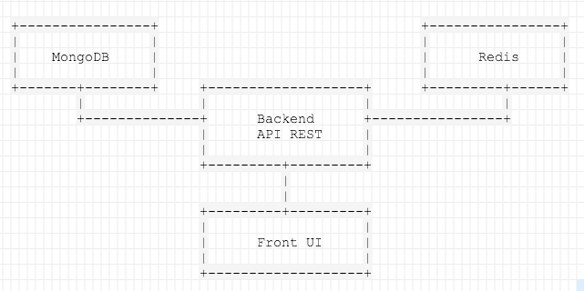

# docker-full-example

A docker based full example deploy & developer environment of a simple
application following a microservice based architecture.

The application itself is going to be enough simple to not deal with
additional and unexpected problems but it will use also use a common stack to
be sure is something close to a real one.

## The application

The example application going to be deployed is a simple poll vote web app
that will use the following components:

* A frontend microservice based on *ExpressJS*, that will be responsible of
  the UI for the final user.
* A backend microservice based on a *REST API* that will manage votes,
  user sessions, etc ...
* The persistence of the votes will be handled by a *MongoDB* database.
* A *Redis* instance will be used to persist user sessions.

# TODO

- [x] Create application example front microservice
- [x] Dockerize application example front microservice
- [ ] Create application example backend component (API Rest)
- [ ] Containerize consul with docker
- [ ] Containerize registrator and integrate it with docker & consul
- [ ] Containerize vault
- [ ] Containerize consul-template
- [ ] Generate configuration for the two app components ( front & back )

# Current status

This project just started, there is nothing working yet but stay tunned ;)
